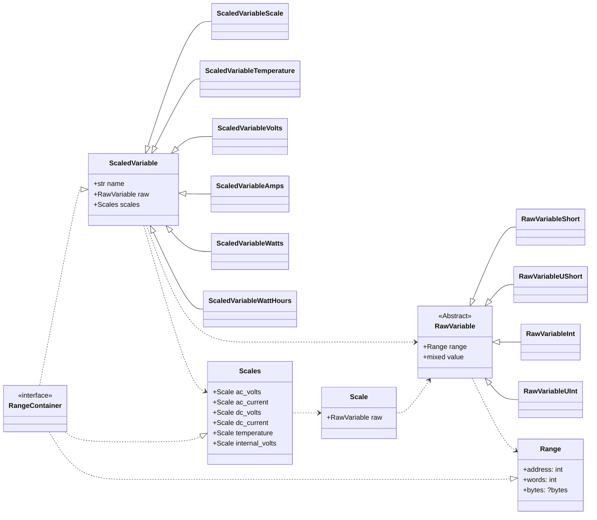
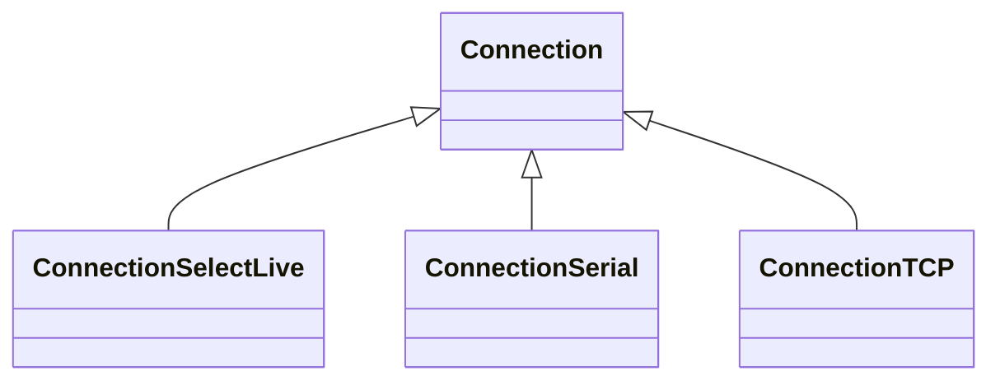

# Modules

## Memory

```mermaid
classDiagram
  %% <|-- Inheritance
  %% *--  Composition
  %% o--  Aggregation
  %% -->  Association
  %% --   Link (Solid)
  %% ..>  Dependency
  %% ..|> Realization
  %% ..   Link (Dashed)

  direction LR
  class ScaledVariable{
    +str name
    +RawVariable raw
    +Scales scales
  }
  ScaledVariable <|-- ScaledVariableScale
  ScaledVariable <|-- ScaledVariableTemperature
  ScaledVariable <|-- ScaledVariableVolts
  ScaledVariable <|-- ScaledVariableAmps
  ScaledVariable <|-- ScaledVariableWatts
  ScaledVariable <|-- ScaledVariableWattHours
  ScaledVariable ..> Scales
  ScaledVariable ..> RawVariable
  RangeContainer ..|> ScaledVariable

  class Scales{
    +Scale ac_volts
    +Scale ac_current
    +Scale dc_volts
    +Scale dc_current
    +Scale temperature
    +Scale internal_volts
  }
  Scales ..> Scale
  RangeContainer ..|> Scales

  class Scale{
    +RawVariable raw
  }
  Scale ..> RawVariable

  %% Raw (unscaled) bytes from SP Pro.
  class RawVariable{
    <<Abstract>>
    +Range range
    +mixed value
  }
  RawVariable <|-- RawVariableShort
  RawVariable <|-- RawVariableUShort
  RawVariable <|-- RawVariableInt
  RawVariable <|-- RawVariableUInt
  RawVariable ..> Range

  class RangeContainer
  <<interface>> RangeContainer

  class Range{
    +address: int
    +words: int
    +bytes: ?bytes
  }
  RangeContainer ..|> Range %% implements
```

## Protocol

```mermaid
classDiagram
  Getter ..> Protocol

  class Getter{
    +Protocol protocol
    +fetch(ranges:List~RangeContainer~) None
  }
  class Protocol{

  }
  class Request{

  }
  class CRC
  class Response
  class reduce
```

## Connection

```mermaid
classDiagram
  Connection <|-- ConnectionSelectLive
  Connection <|-- ConnectionSerial
  Connection <|-- ConnectionTCP
```
