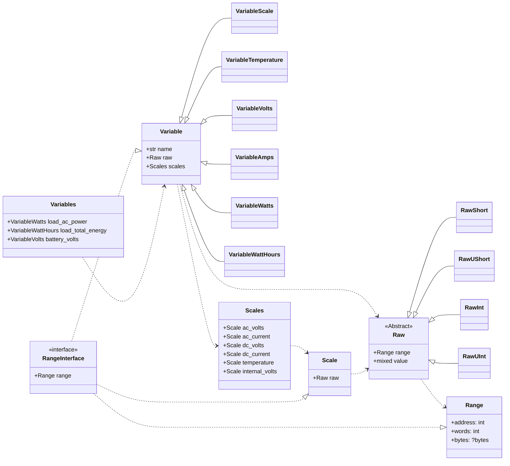
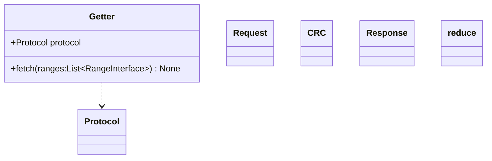
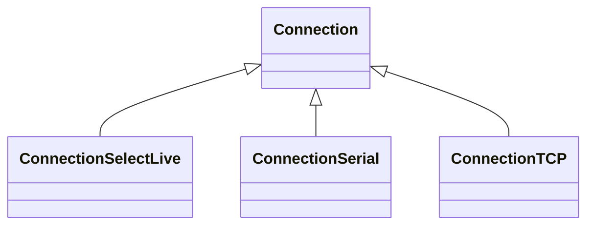

# Modules

## Memory

```mermaid
classDiagram
  %% <|-- Inheritance
  %% *--  Composition
  %% o--  Aggregation
  %% -->  Association
  %% --   Link (Solid)
  %% ..>  Dependency
  %% ..|> Realization
  %% ..   Link (Dashed)

  direction LR
  class Variable{
    +str name
    +Raw raw
    +Scales scales
  }
  Variable <|-- VariableScale
  Variable <|-- VariableTemperature
  Variable <|-- VariableVolts
  Variable <|-- VariableAmps
  Variable <|-- VariableWatts
  Variable <|-- VariableWattHours
  Variable ..> Scales
  Variable ..> Raw
  RangeInterface ..|> Variable

  class Variables{
    +VariableWatts load_ac_power
    +VariableWattHours load_total_energy
    +VariableVolts battery_volts
  }
  Variables ..> Variable

  class Scales{
    +Scale ac_volts
    +Scale ac_current
    +Scale dc_volts
    +Scale dc_current
    +Scale temperature
    +Scale internal_volts
  }
  Scales ..> Scale

  class Scale{
    +Raw raw
  }
  Scale ..> Raw
  RangeInterface ..|> Scale

  %% Raw (unscaled) bytes from SP Pro.
  class Raw{
    <<Abstract>>
    +Range range
    +mixed value
  }
  Raw <|-- RawShort
  Raw <|-- RawUShort
  Raw <|-- RawInt
  Raw <|-- RawUInt
  Raw ..> Range

  class RangeInterface{
    <<interface>>
    +Range range
  }

  class Range{
    +address: int
    +words: int
    +bytes: ?bytes
  }
  RangeInterface ..|> Range %% implements
```

## Protocol

```mermaid
classDiagram
  Getter ..> Protocol

  class Getter{
    +Protocol protocol
    +fetch(ranges:List~RangeInterface~) None
  }
  class Protocol{

  }
  class Request{

  }
  class CRC
  class Response
  class reduce
```

## Connection

```mermaid
classDiagram
  Connection <|-- ConnectionSelectLive
  Connection <|-- ConnectionSerial
  Connection <|-- ConnectionTCP
```
